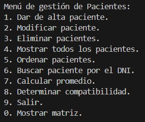

# RPP_PROGRAMACION_I_111_Cordoba

## :point_right: Estudiante :point_left:
- Nombre: Jerónimo F.L. Córdoba
- Division: 111-1

## :goberserk: 1° Parcial - Programación I :goberserk:
## :memo: Menu sobre los pacientes :memo:

## :book: Descripción :book: ##
En el parcial nos tenemos que hacer cargo de la gestión de la clinica VIDDA
donde el usuario interactua con nuestro sistema

## :notebook: Funciones :notebook: ##
 - Dar de alta pacientes
 - Modificar los datos teniendo en cuenta el DNI
 - Eliminar el pacientes y agregarlo a la lista de eliminados 
 - Mostrar todos los pacientes
 - Ordenar los pacientes segun la elección 
 - Buscar un pacientes por el DNI
 - Calcular el promedio segun la elección
 - Determinar la compatibilidad sanguinea
 - Salir del programa
 - Mostrar una matriz de sangre

 ## :clapper: Video :clapper:
- https://drive.google.com/drive/folders/1foUA55yAWskxT86SdhnfpmefDPXIRhGh

Pido perdón por la marca de agua y por el problema del sonido, pero tambien sube el video de la camara de la defensa oral para que vean
que esta todo en orden, por cualquier cosa avisen, estare siempre atento, se que esta en destiempo, pero la importación del video me tomo mucho rato. Y nuevamente pido perdón por el tema del video pero no se como editar para que quede todo bien
